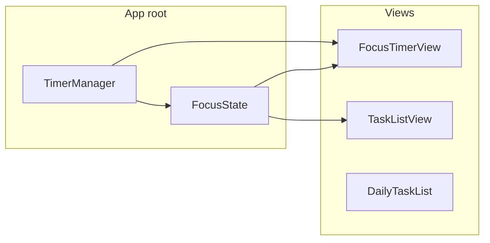

# Flowcus: ADHD-Focused Productivity App — Full Plan

A detailed, research-backed plan to turn Flowcus into a **standout productivity app designed exclusively for people with ADHD and low attention span**. This document covers research, design principles, feature specifications, UX copy, technical implementation, and a phased rollout from start to finish.

---

## Part 1 — Research Summary

### 1.1 Why Generic Productivity Apps Fail ADHD Users

- **Executive dysfunction**: Time blindness, difficulty estimating duration, task initiation, and switching. Traditional tools assume accurate time perception and sustained motivation. [[1]](https://www.additudemag.com/punctuality-time-blindness-adhd-apps-tips/) [[2]](https://discovery.ucl.ac.uk/id/eprint/1543889/1/Marshall_A%20Design%20Framework%20for%20ADHD%20Assistive%20Technologies%20v5.pdf)
- **Decision fatigue**: Each extra choice depletes limited cognitive resources faster than in neurotypical users. Complex UIs and many options increase abandonment. [[3]](https://www.addrc.org/adhd-and-decision-fatigue-why-simple-choices-can-feel-overwhelming/)
- **Motivation/reward**: ADHD brains respond more to immediate, visible rewards than to long-term outcomes. Delayed gratification is harder; small wins and instant feedback work better. [[4]](https://www.tiimoapp.com/resource-hub/gamification-adhd)
- **Adoption reality**: Only a small fraction of ADHD adults find productivity apps "extremely helpful"; common barriers include forgetting the app exists, complexity, and redundancy. [[5]](https://pressbooks.pub/thealttext/chapter/effectiveness-and-challenges-of-task-management-apps-for-students-with-adhd-a-focus-on-task-organization-and-time-management/)

### 1.2 What Works: Evidence-Based Patterns

| Challenge | What works | Source |
|-----------|------------|--------|
| Time blindness | **Visual time** (shrinking ring, filling bar, radial clock) instead of numbers; "ends at 3:45 PM" | Visual timers, DayZen, ADHD Timer & Focus Coach |
| Task overwhelm | **One task at a time**; "today" or "one thing" focus; break big tasks into steps | Purely.app, That One Thing, Tiimo |
| Low motivation | **Gamification**: XP, points, optional streaks (without shame if broken); immediate feedback | Habitica, Tiimo, Healthline gamification for ADHD |
| Guilt/shame | **Zero-shame design**: no error red, no punishing streaks; "nudges not alarms"; stop early anytime | Dubbii, SideQuest, Gravity Well design |
| Notifications | **Gentle nudges**; context-relevant sounds; user-controlled timing; avoid alarm-style | Gravity Well, research on SMS/reminders |
| Decision fatigue | **Few choices**; 2–3 options; sensible defaults; "new tasks use Pomodoro" toggle | Additude, ADDRC decision fatigue |
| Accountability | **Body doubling** (future); external structure; "focus with this task" link | Focusmate, Deepwrk, Cleveland Clinic |
| Linking time + task | **One Pomodoro = one task**; estimate pomodoros per task; start focus from task | Todoist+Pomodoro, Pragmatic Engineer |

### 1.3 Design Frameworks Referenced

- **MIIS / AES / CCD**: Manually interacting with info, automatic execution from context, capturing context for later — maps ADHD challenges to tech opportunities. [[6]](https://ieeexplore.ieee.org/document/10253776)
- **Participatory design**: Co-design with ADHD users; avoid imposing neurotypical productivity models. [[7]](https://samitabelliganood.medium.com/co-designing-with-graduate-students-with-adhd-an-in-depth-look-at-a-participatory-ux-research-2563124edc77)

---

## Part 2 — Product Positioning and Principles

### 2.1 One-Line Positioning

**"Flowcus is the Pomodoro-first productivity app for ADHD: one task, one focus session, no guilt, built for short attention spans."**

### 2.2 Core Principles (Non-Negotiable)

1. **Pomodoro-first, task-linked** — The timer is the core loop; tasks exist to give focus a name. Every focus session can be tied to one task.
2. **One thing at a time** — Emphasize "today" and "this focus = this task." No overwhelming lists; support a single active focus.
3. **Low shame, high flexibility** — Stop early anytime. No punishing streaks. Gentle language. Optional features, not obligations.
4. **Visual time** — Time shown as liquid/ring/bar; show "Focus ends at X" to fight time blindness.
5. **Few decisions** — Sensible defaults (e.g. 15 or 25 min), one-tap "Start focus for this task," optional "Pomodoro for new tasks."
6. **Immediate reward** — XP or progress visible right after a session; optional light gamification without guilt.

### 2.3 Out of Scope (For This Plan)

- Full body-doubling (video/coworking) — future phase.
- Cross-device sync / accounts — keep local-first for v1.
- Complex project/subtask hierarchies — keep flat tasks + optional "estimated pomodoros."

---

## Part 3 — User Persona and Jobs-to-Be-Done

### 3.1 Primary Persona

- **Name**: Alex (placeholder).
- **Self-identifies**: ADHD and/or low attention span.
- **Frustrations**: TickTick/To-Do apps feel like "another list I forget"; timer apps are disconnected from what to do; 25 minutes often feels too long; guilt when stopping early or missing a day.
- **Goals**: Know what to work on *right now*, see time passing in a way that doesn’t feel abstract, feel good when finishing a focus block (even short), and have one place for "today’s tasks + focus."

### 3.2 Jobs-to-Be-Done

| Job | Success definition |
|-----|--------------------|
| **Start focus without deciding** | Tap one task → timer starts for that task; no extra steps. |
| **See time in a way that helps** | Liquid/visual timer + "Ends at 3:45 PM" (or similar). |
| **Feel okay stopping early** | No penalty; optional "I’m done early" to log and move on. |
| **Remember what I was focusing on** | Focus screen always shows "Focusing on: [task name]." |
| **Track progress without pressure** | "2 pomodoros" per task; no mandatory streak. |

---

## Part 4 — Feature Specification (Detail)

### 4.1 Task–Pomodoro Link (Core Feature)

**4.1.1 Data model (TaskItem)**

- `usePomodoro: Bool` — Default `false` for backward compatibility. When true, task shows "Start focus" and can be the active focus task.
- `pomodorosCompleted: Int` — Count of completed focus sessions for this task. Shown as "2 pomodoros" or "2/4" if estimated.
- `estimatedPomodoros: Int?` — Optional. If set, show "2/4" style; no obligation to complete all.

**4.1.2 Task list UI (per row)**

- Checkbox (existing) + title (existing).
- **Pomodoro toggle**: Small control (e.g. tomato icon or "Focus" label) to set `usePomodoro`. Only show "Start focus" when true.
- **Start focus** button/icon: Tappable when `usePomodoro == true` and task is not completed. Action: set app-level "current focus task" = this task, set timer duration (see 4.2), switch to Focus tab, start timer.
- **Progress**: When `pomodorosCompleted > 0`, show e.g. "2 pomodoros" or "2/4" (if `estimatedPomodoros` is set). No red or guilt if 2/4 and user stops.

**4.1.3 Focus screen when linked to a task**

- **Subtitle**: "Focusing on: [task title]" (below or above timer). If no task linked, show "Focus" or "General focus" (current behavior).
- **On session complete**: If current task is set, increment `pomodorosCompleted` and save; optional short confirmation ("+1 pomodoro for [task]"). Then either clear current task or offer "One more for this task?" (single button).

**4.1.4 Settings**

- **"New tasks use Pomodoro by default"** (`@AppStorage("newTasksUsePomodoro")`): When adding a task, set `usePomodoro = newTasksUsePomodoro`.

### 4.2 Timer and Time Blindness

**4.2.1 Flexible work duration**

- Keep existing 1–60 min (or presets: 10, 15, 25, 45). Add a **default for "short focus"** in settings, e.g. "Default focus length" with 15 min as ADHD-friendly default option.
- No separate "per-task duration" in v1 unless trivial: one global default is enough to reduce decisions.

**4.2.2 Visual time (already partially there)**

- Current liquid fill is strong. Ensure it’s the **primary** time cue (not only the digits). Consider optional "Zen" mode: hide digits, only liquid (for users who find numbers stressful).

**4.2.3 "Focus ends at" (time blindness)**

- When starting a focus session, compute and show: "Focus ends at [e.g. 3:45 PM]." Place near the Start button or below the timer. Format: `Date().addingTimeInterval(timerManager.timeRemaining).formatted(date: .omitted, time: .shortened)`.

**4.2.4 Gentle completion**

- Keep haptic; avoid loud alarm. Optional: soft completion sound (off by default). Copy: "Break time" or "Nice one — take a break" instead of "Time’s up!"

### 4.3 Guilt-Free and Low-Friction UX

**4.3.1 Stopping early**

- **Stop / End session** always available. No "Are you sure?" for stopping. Optional: "I’m done early" that still awards partial XP (e.g. proportional to % completed) and transitions to break — no shame message.

**4.3.2 No punishing streaks**

- If you add streaks later, make them "celebratory only": e.g. "3 days in a row!" with no message when broken. No "You lost your streak."

**4.3.3 Errors and empty states**

- No harsh red error messages. Use neutral or soft tones. Empty states: encouraging ("Add one task and hit focus") not accusatory.

### 4.4 Gamification (Light, Optional)

- **XP on completion**: Keep; optionally tie to "pomodoro completed for a task" so progress feels task-specific.
- **No mandatory streaks**: As above.
- **Optional daily goal**: e.g. "1 focus session today" — if shown, frame as "You did it!" when met, not "You failed" when not.

### 4.5 "One Task" Emphasis (Today View)

- **Default tab**: Consider defaulting to Tasks with "Today" pre-selected (already date-based). Optional: "Today’s focus" hero section showing 1–3 tasks with Pomodoro on and a single "Start with [first task]" CTA.
- **Single active focus**: Only one task can be "current focus task" at a time. Starting focus for another task switches the link.

### 4.6 Notifications (If Added Later)

- **Nudges, not alarms**: e.g. "You have a focus session ready — [task name]" 2–5 minutes before a scheduled time (if you add scheduling).
- **Contextual**: Optional sound per task type (e.g. different for "email" vs "deep work") — research shows context-relevant sounds help. [[8]](https://gravitywell.co.uk/insights/how-we-designed-an-adhd-friendly-mobile-app)
- **User control**: Enable/disable and quiet hours in settings.

### 4.7 Copy and Microcopy (Examples)

| Context | Avoid | Use |
|---------|--------|-----|
| Session end | "Time’s up!" | "Break time" / "Nice one — take a break" |
| Stop early | "Quit session?" | "End session" (no guilt) / "I’m done early" |
| Empty tasks | "No tasks" | "Add one task, then tap Focus" |
| Task progress | "2 of 4 required" | "2 pomodoros" / "2/4 (optional)" |
| First run | Long onboarding | 1–2 screens: "Pick a task, tap Focus. That’s it." |
| Settings | "Pomodoro duration" | "Focus length" / "Short (15 min) / Standard (25)" |

---

## Part 5 — Technical Implementation (Detail)

### 5.1 Architecture Overview

- **Shared state**: One `TimerManager` and one "focus state" object (current task id + title) at app root, injected via `@EnvironmentObject` or `@StateObject` in `ContentView`.
- **Tab switching**: `ContentView` holds `@State var selectedTab` and passes `Binding` so "Start focus for task" can switch to Focus tab programmatically.

### 5.2 File-by-File Changes

**Flowcus/Models.swift**

- Add to `TaskItem`: `var usePomodoro: Bool = false`, `var pomodorosCompleted: Int = 0`, `var estimatedPomodoros: Int? = nil`.
- Update initializer and ensure SwiftData schema includes new properties (FlowcusApp already has schema + migration/reset path).

**Flowcus/TimeManager.swift**

- Add: `var currentTaskId: PersistentIdentifier?`, `var currentTaskTitle: String?` (for display without holding a model reference).
- Add: `var onSessionComplete: (() -> Void)?` or delegate/callback so the app can increment `pomodorosCompleted` and persist (ModelContext in view layer).
- Alternatively: keep `TimerManager` free of task id and put `currentTaskId`/`currentTaskTitle` in a small `@Observable FocusState` class that ContentView owns and passes down.

**Flowcus/FlowcusApp.swift**

- No schema change needed if only adding optional/defaulted fields; confirm SwiftData migration or dev-store reset handles it.

**Flowcus/ContentView.swift**

- **Root**: Create `@StateObject private var timerManager = TimerManager()` and optionally `@StateObject private var focusState = FocusState()` (or extend TimerManager). Pass both into `FocusTimerView` and `TaskListView` via `.environmentObject()` or explicit parameters. Add `@State private var selectedTab = 0` (or enum) and use `TabView(selection: $selectedTab)`.
- **FocusTimerView**: Accept `timerManager` and `focusState` (or equivalent). Display `focusState.currentTaskTitle` as "Focusing on: ...". On session complete (existing `completeTimer` or `completeSession`), call focusState’s completion handler so ContentView (or a coordinator) can: find task by id, increment `pomodorosCompleted`, save context, clear current task.
- **TaskListView / DailyTaskList**: Accept `timerManager`, `focusState`, and `Binding<Int>` for selected tab. In each task row: Pomodoro toggle, "Start focus" button (when `usePomodoro`), pomodoro count. On "Start focus": set `focusState.currentTaskId`/`currentTaskTitle`, set timer duration, `selectedTab = focusTabIndex`, `timerManager.start()`.
- **Settings**: Add "New tasks use Pomodoro by default" and "Default focus length" (e.g. 15 / 25 min). Add "Focus ends at" label when starting session (in FocusTimerView).

### 5.3 Persistence and Identity

- Use SwiftData’s `PersistentIdentifier` (or stable id) for `currentTaskId` so you don’t hold a `TaskItem` reference across views (avoiding lifecycle issues). Resolve id to `TaskItem` in modelContext when incrementing `pomodorosCompleted`.

### 5.4 Testing Checklist (Acceptance Criteria)

- [ ] Add task → toggle "Use Pomodoro" → "Start focus" appears; tap → Focus tab opens, timer runs, "Focusing on: [title]" visible.
- [ ] Complete session → task’s `pomodorosCompleted` increases by 1; optional "One more?" works.
- [ ] Stop early → no error; optional "I’m done early" gives partial XP and clears session.
- [ ] "Focus ends at [time]" appears when starting focus.
- [ ] New task with "New tasks use Pomodoro" on → `usePomodoro == true`.
- [ ] Default focus length 15 min → new session starts with 15 min.

---

## Part 6 — Phased Implementation (Start to Finish)

### Phase 1 — Foundation (Task–Timer Link)

**Goal**: One task can drive the focus timer; Focus tab shows task name; completion increments that task’s pomodoro count.

**Steps**:

1. **Model**: Add `usePomodoro`, `pomodorosCompleted`, `estimatedPomodoros` to `TaskItem` in Models.swift. Bump schema / test migration.
2. **Shared state**: Introduce app-level `TimerManager` (and minimal `FocusState` with `currentTaskId`, `currentTaskTitle`, completion callback) in ContentView; inject into Focus and Tasks.
3. **Tab selection**: Add `selectedTab` to ContentView; TabView(selection:); expose binding to TaskListView.
4. **Task row**: Add "Start focus" button (always, or when a simple "focus" flag is on). On tap: set current task, set timer duration from AppStorage default, switch to Focus tab, start timer.
5. **Focus view**: Show "Focusing on: [title]" when current task is set. On session complete: resolve task by id, increment `pomodorosCompleted`, save, clear current task (or show "One more?").
6. **Manual test**: Full flow from task → focus → complete → verify count.

**Deliverable**: Working task–timer link; no UI for toggling "use Pomodoro" yet (treat all tasks as focusable, or default true for new).

### Phase 2 — Per-Task Pomodoro and Settings

**Goal**: User can enable/disable Pomodoro per task; new-task default; "Focus ends at" and default focus length.

**Steps**:

1. **Task row**: Add Pomodoro toggle (icon or switch) to set `usePomodoro`. "Start focus" only when true. Show "X pomodoros" when `pomodorosCompleted > 0`.
2. **Settings**: "New tasks use Pomodoro by default" (AppStorage). When creating task in DailyTaskList, set `usePomodoro` from this setting.
3. **Settings**: "Default focus length" (e.g. 15, 25 min). Use when starting from task (and when starting generic focus).
4. **Focus view**: Add "Focus ends at [time]" when starting/running session.
5. **Copy**: Replace "Time’s up!" with "Break time" (or similar); ensure "End session" has no guilt modal.

**Deliverable**: Full per-task control; time-blindness hint; gentle copy.

### Phase 3 — ADHD Polish and Optional Features

**Goal**: Short-focus default, optional "I’m done early," optional estimated pomodoros, empty-state and first-run copy.

**Steps**:

1. **Estimated pomodoros**: Optional field in task (e.g. long-press or (i) to set "Est. pomodoros: 4"). Show "2/4" in list.
2. **"I’m done early"**: Button when paused or running; awards proportional XP; ends session and moves to break.
3. **Empty states**: Copy from table in 4.7; "Add one task, then tap Focus."
4. **Onboarding**: 1–2 screens: "Pick a task, tap Focus. That’s it." with Skip.
5. **Optional**: "Zen" timer mode (liquid only, no digits) in settings.
6. **Optional**: Daily goal "1 focus session" with positive-only feedback.

**Deliverable**: Feels distinctly ADHD-friendly: flexible, visual, guilt-free, minimal decisions.

### Phase 4 — Future (Not in Initial Scope)

- Body doubling (e.g. "Focus with others" link or integration).
- Widgets: "Today’s task" or "Current focus."
- Gentle notifications: "You have [task] ready to focus on."
- Sync / account (if ever).

---

## Part 7 — Success Metrics and Differentiation

### 7.1 How Flowcus Stands Out

- **Only app that is Pomodoro-first and task-linked by default**: Timer isn’t an add-on; the primary action is "Start focus for this task."
- **Built for low attention span**: Short default (15 min), visual time, "Focus ends at," one task at a time.
- **Explicitly guilt-free**: No punishing streaks, no shame for stopping early, gentle copy.
- **Minimal decisions**: One-tap focus from task, few settings, sensible defaults.

### 7.2 Success Metrics (Qualitative and Quantitative)

- User can go from "I have a task" to "timer running for that task" in **one tap** (after enabling Pomodoro for that task).
- "Focus ends at" and liquid timer both visible so **time is perceivable** without reading digits.
- **No negative copy** in core flows (stop early, empty state, session end).
- Optional: in-app or survey: "This app doesn’t make me feel guilty when I stop early" (agree/disagree).

---

## Part 8 — Summary Checklist

- [ ] Research integrated: time blindness, one task, gamification, guilt-free, nudges, decision fatigue.
- [ ] Positioning: Pomodoro-first for ADHD; one task, one focus; no guilt.
- [ ] Data model: `usePomodoro`, `pomodorosCompleted`, `estimatedPomodoros` on TaskItem.
- [ ] Shared TimerManager + FocusState at root; tab switching from Tasks to Focus.
- [ ] Task row: Pomodoro toggle, Start focus, pomodoro count; Focus screen: "Focusing on: [task]", "Focus ends at", gentle completion copy.
- [ ] Settings: New tasks use Pomodoro default; default focus length.
- [ ] Phases 1 → 2 → 3 implemented in order; Phase 4 deferred.

---

*This plan is designed to be implemented as-is. After your review and any tweaks, development can follow Phase 1 through Phase 3 for a complete, standout ADHD productivity experience.*
